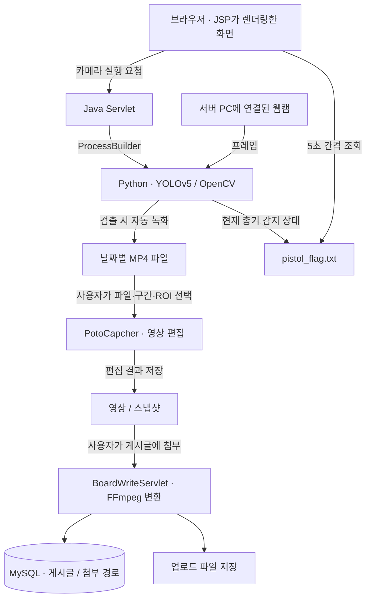

# AI 방범 카메라 — 영상 감지와 웹 연동

YOLOv5로 웹캠 영상의 객체를 검출하고, 녹화한 영상을 편집해 웹 게시판에서 확인할 수 있도록 만든 개인 프로젝트입니다. Python 영상 처리와 Java 웹 사이의 실행·파일 전달 흐름을 연결했습니다.

| 항목 | 내용 |
| --- | --- |
| 기간 | 2024 ~ 2025년 · 약 7개월 |
| 형태 | 개인 프로젝트 |
| 담당 | 데이터 수집·라벨링, 총기 감지 모델 학습, 감지·녹화·편집 기능, Java 웹 연동 |
| 주요 기술 | Python, YOLOv5, OpenCV, Java, JSP/Servlet, JDBC, MySQL, FFmpeg |

## 개발 배경

자주 이용하던 역에서 발생한 칼부림 사건을 계기로, 위험 상황을 더 빨리 확인할 수 있는 방법을 고민했습니다. 영상 속 대상을 감지하는 기능에서 시작해, 감지 영상을 저장하고 필요한 구간을 편집한 뒤 웹에서 확인하는 흐름까지 구현했습니다.

일반 객체 검출에는 사전 학습된 YOLOv5s를 사용하고, 별도로 수집·라벨링한 이미지로 `pistol` 클래스를 학습했습니다. 현재 구현의 위험 물체 감지 대상은 총기입니다.

## 주요 기능

| 기능 | 동작 |
| --- | --- |
| 객체 검출 | 웹캠 프레임에서 사람·동물·물병 등 선택한 12개 클래스와 총기를 검출 |
| 결과 표시 | 감지한 대상의 위치와 이름을 바운딩 박스로 표시 |
| 자동 녹화 | 대상이 감지되면 녹화하고, 마지막 검출 이후 3초가 지나면 종료 |
| 웹 알림 | 총기 감지 상태를 파일에 기록하고 브라우저에서 5초 간격으로 조회 |
| 영상 편집 | 날짜·파일 선택, 프레임 이동, 구간 지정, ROI 선택, 스냅샷·영상 저장 |
| 게시판 | 이미지·영상 첨부, 게시글 작성·조회·수정·삭제 |

객체 위치는 프레임마다 새로 검출합니다. 객체 ID를 유지하는 추적 기능이나 프레임 간 움직임 분석은 구현 범위에 포함하지 않았습니다.

## 처리 흐름



카메라와 OpenCV 창은 Tomcat에서 실행한 Python 프로세스가 동작하는 PC에서 열립니다. 브라우저에서 요청을 보내면 서버 PC의 웹캠을 사용하며, 영상 편집과 게시글 업로드는 사용자가 직접 진행합니다.

## 구현 과정

### 두 모델의 검출 결과를 녹화 조건으로 연결

일반 객체용 YOLOv5s와 총기용 커스텀 모델을 CPU에서 실행했습니다. 일반 모델의 결과 중 `person`, `dog`, `cat`, `bird`, `cow`, `horse`, `sheep`, `elephant`, `bear`, `zebra`, `giraffe`, `bottle`을 녹화 대상으로 선택했습니다.

선택한 대상이나 `pistol`이 감지되면 마지막 검출 시각을 갱신합니다. 대상이 잠깐 사라져도 파일이 바로 끊기지 않도록 3초의 여유 시간을 두고 녹화를 종료했습니다.

- [감지·녹화 코드](python/bbcamara.py)
- [모델 구성과 경로 설정](MODEL_GUIDE.md)

### Python의 감지 상태를 Java 웹에서 확인

Python이 `pistol_flag.txt`에 `detected` 또는 `none`을 기록하고, `menu.jsp`가 이 파일을 5초마다 조회하도록 연결했습니다. 이 파일은 현재 감지 상태를 덮어쓰는 용도이며, 감지 이력을 누적하는 로그와는 구분됩니다.

- [웹 알림 처리](src/main/webapp/menu.jsp)
- [카메라 실행 Servlet](src/main/java/com/example/lim/CameraServlet.java)

### 녹화 영상의 편집과 게시판 업로드

`PotoCapcher.py`에서 날짜별 녹화 파일을 선택하고 필요한 구간이나 ROI를 저장할 수 있도록 만들었습니다. 게시글에 영상을 첨부하면 FFmpeg로 변환한 뒤 파일 경로를 게시글과 함께 DB에 저장합니다.

현재 Java 요청은 Python 또는 FFmpeg 프로세스가 끝날 때까지 기다립니다. 긴 영상 처리와 웹 요청을 분리하는 작업은 다음 개선 과제로 두었습니다.

- [영상 편집 코드](python/PotoCapcher.py)
- [영상 첨부·변환 코드](src/main/java/com/example/lim/BoardWriteServlet.java)

## 기술 구성

| 구분 | 기술 |
| --- | --- |
| 영상 처리 | Python, PyTorch, YOLOv5, OpenCV, NumPy, Pillow |
| 웹 서버 | Java, JSP/Servlet, JSTL, Tomcat |
| 데이터 저장 | JDBC, MySQL |
| 영상 변환 | FFmpeg |
| 개발 도구 | Maven, IntelliJ IDEA, Labelme |

Spring·MyBatis 의존성은 `pom.xml`에 포함되어 있지만, 카메라 실행과 게시판의 주요 기능은 Servlet·JDBC로 구현했습니다. Python 패키지는 [requirements.txt](python/requirements.txt)에 정리했습니다.

## 실행 환경 설정

Windows의 로컬 Tomcat과 Python GUI 실행을 기준으로 경로를 구성했습니다. 저장소에는 실행 환경에 맞춰 바꿔야 하는 경로와 DB 설정이 있습니다.

1. Python 환경을 준비하고 `python -m pip install -r python/requirements.txt`로 패키지를 설치합니다.
2. [MODEL_GUIDE.md](MODEL_GUIDE.md)를 따라 저장소 루트의 `best.pt`와 `bbcamara.py`의 모델 경로를 연결합니다.
3. [DB 설정 안내](database/README.md)에 따라 `security_camera` 데이터베이스를 준비합니다.
4. 아래 실행 경로와 파일 저장 경로를 맞춥니다.
5. IDE에서 Maven 프로젝트와 로컬 Tomcat을 연결하고 WAR를 배포합니다.

| 파일 | 설정할 내용 |
| --- | --- |
| `python/bbcamara.py` | 모델 경로, 녹화 폴더, Tomcat에서 읽을 플래그 파일 경로 |
| `python/PotoCapcher.py` | 원본 영상 폴더, 편집 결과 폴더, 글꼴 경로 |
| `CameraServlet.java`, `CameraEditServlet.java` | Python 실행 파일과 스크립트 경로 |
| `BoardWriteServlet.java` | FFmpeg 실행 파일 경로 |
| DB를 사용하는 Servlet·JSP | MySQL 접속 주소와 계정 |

Maven의 컴파일 설정은 `source/target 1.6`으로 남아 있습니다. 프로젝트 JDK와 빌드 설정을 함께 확인한 뒤, Tomcat에 설정한 컨텍스트 경로로 접속합니다.

```text
http://localhost:8080/<컨텍스트 경로>/
```

카메라를 실행한 상태에서 웹 알림을 확인하려면 메뉴 화면을 별도 탭에 열어 둡니다. 영상 저장과 플래그 파일 기록이 가능한 경로인지도 확인합니다.

## 개선 과제

- **감지 결과 검증**: 조명·거리·가림 조건별로 오탐·미탐을 정리하고, 처리 FPS와 웹 알림 지연을 측정하려고 합니다.
- **이벤트 전달**: 현재 상태 파일을 덮어쓰는 방식에서 짧은 감지 이벤트가 누락될 수 있어, 이벤트 저장과 전달 방식을 보완하려고 합니다.
- **프로세스 관리**: 카메라 실행과 영상 변환을 요청 처리에서 분리하고, 중복 실행·종료·실패 상태를 관리할 계획입니다.
- **실행 설정 정리**: PC별 경로와 DB 설정을 외부 설정으로 모아 실행 준비 과정을 줄이려고 합니다.

## 라이선스

MIT License

## 개발자

임재민 · [GitHub](https://github.com/jeaminlim0000)
